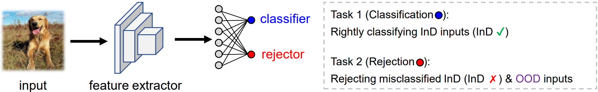
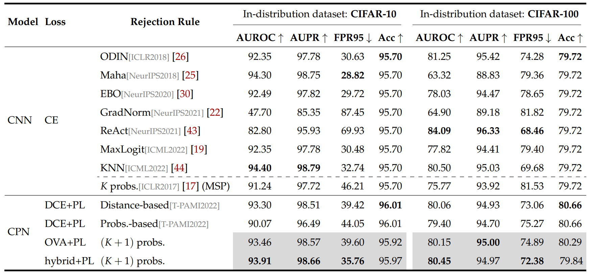
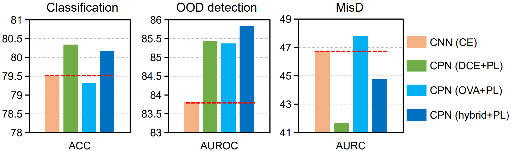
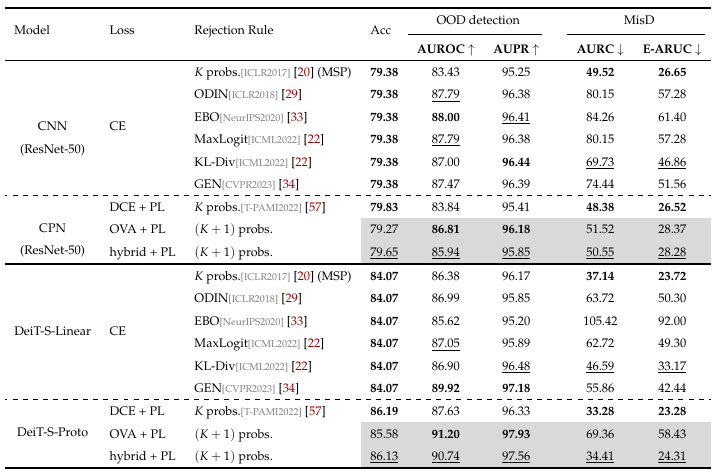

# Clasificación y Rechazo Unificados: Un Marco Uno-contra-Todos

Este repositorio es la implementación en PyTorch del artículo [Clasificación y Rechazo Unificados: Un Marco Uno-contra-Todos](https://arxiv.org/abs/2311.13355). En este artículo, proponemos un marco unificado para el Reconocimiento de Conjuntos Abiertos (OSR) o la detección de Fuera de Distribución (OOD), realizando la clasificación y el rechazo de múltiples clases mediante un único clasificador, entrenado con aprendizaje uno-contra-todos (OVA) sin muestras OOD. Este repositorio también proporciona el código para entrenar una red de prototipos convolucionales (CPN) basada en la pérdida de entropía cruzada basada en distancia (DCE), propuesta por [Yang et al.,2018](https://arxiv.org/abs/1805.03438) y [Yang et al.,2022](https://ieeexplore.ieee.org/document/9296325).
<p align="center">
    
</p>
<p align="center">

## Configuración del entorno
Este proyecto se ha desarrollado en los siguientes entornos:
<ul>
  <li>OS: Ubuntu 20.04.3</li>
  <li>GPU: RTX 3090</li>
  <li>CUDA: 11.2</li>
  <li>Python: 3.7.13</li>
  <li>PyTorch: 1.12.1</li>
  <li>Torchvision: 0.13.1</li>
</ul>


## Uso
### 1. Preparación del conjunto de datos
#### Conjunto de datos de distribución extraña para CIFAR

Proporcionamos enlaces para descargar cada conjunto de datos: [Textures](https://www.robots.ox.ac.uk/~vgg/data/dtd/), [Places365](http://places2.csail.mit.edu/download.html), [LSUN-C](https://www.dropbox.com/s/fhtsw1m3qxlwj6h/LSUN.tar.gz), [LSUN-R](https://www.dropbox.com/s/moqh2wh8696c3yl/LSUN_resize.tar.gz), [iSUN](https://www.dropbox.com/s/ssz7qxfqae0cca5/iSUN.tar.gz) y [SVHN](http://ufldl.stanford.edu/housenumbers/test_32x32.mat). Descárguelos y colóquelos en la carpeta `datasets/ood_data/DATASET`. 

#### Conjunto de datos de distribución extraña para ImageNet-200
Contamos con entradas OOD de Textures para la evaluación en el benchmark de ImageNet, y se puede descargar mediante el [enlace](https://www.robots.ox.ac.uk/~vgg/data/dtd/).


### 2. Entrenamiento
Para ejecutar CPN basado en el principio de entrenamiento OVA o DCE para CIFAR/WRN-28-10, un ejemplo es:
```
cd ./CIFAR/cifar_scripts
bash cifar_wrn_ova.sh
bash cifar_wrn_dce.sh
```

Para ejecutar CPN basado en el principio de entrenamiento OVA o DCE para ImageNet-200/ResNet-50, un ejemplo es:
```
cd ./ImageNet200/ImageNet_scripts
bash imagenet_ova.sh
bash imagenet_dce.sh
```

Para ejecutar el clasificador de prototipos basado en el principio de entrenamiento OVA o DCE para ImageNet-500/DeiT-S, consulte:  
```
cd ./ImageNet500-DeiT
bash train.sh
```


### 3. Pruebas

Para ejecutar la evaluación de CPN basada en OVA o DCE para CIFAR-10/WRN-28-10, un ejemplo es:
```
eval_cifar_ova.py --model wrn-28-10  \
    --model-path "checkpoints_download_cifar/cifar10_wrn_temp3p0_ova.pth"  \
    --temp 3.0  \
    --dataset cifar-10  \
    --score ova|sigmoid
```
```
eval_cifar_dce.py --model wrn-28-10  \
    --model-path "checkpoints_download_cifar/cifar10_wrn_temp2p0_dce.pth"  \
    --temp 2.0  \
    --dataset cifar-10  \
    --score dist|prob
```
Para ejecutar la evaluación de CPN basada en OVA o DCE para ImageNet-200/ResNet-50, un ejemplo es:
```
python eval_cpn_ova.py --arch resnet50  \
    --temp 1.50  \
    --model_path "checkpoints_download_imagenet/resnet50_200_1.5_0.8_ova.pth.tar"  \
    --name evaluation  \
    --ID_dataset_dir 'imagenet/'  \
    --OOD_dataset_dir 'imagenet_ood/'  \
    --score_OOD ova|sigmoid
```
```
python eval_cpn_dce.py --arch resnet50  \
    --temp 1.50  \
    --model_path "checkpoints_download_imagenet/resnet50_200_1.5_dce.pth.tar"  \
    --name evaluation  \
    --ID_dataset_dir 'imagenet/'  \
    --OOD_dataset_dir 'imagenet_ood/'  \
    --score_OOD prob
```
Para ejecutar la evaluación del clasificador de prototipos basada en OVA o DCE para ImageNet-500/DeiT-S, consulte:
```
python test_ood_ova.py \
    --model_path <checkpoint>  \
    --name evaluation  \
    --ID_dataset_dir 'imagenet/'  \
    --OOD_dataset_dir 'imagenet_ood/'  \
    --score_OOD ova|sigmoid
```

Proporcionamos los pesos de [CIFAR/WRN-28-10](https://drive.google.com/drive/folders/1zA1_LrFniLsqT7lsxm288jieVbNdSywh?usp=drive_link) y [ImageNet200/ResNet50](https://drive.google.com/drive/folders/179oyS6Oetssnlo5tvpo17NYRcEfrmvfM?usp=drive_link). Los modelos entrenados pueden evaluarse para reproducir los resultados reportados en el artículo. El código para entrenar el clasificador de prototipos utilizando DeiT-S está implementado en base al [repositorio oficial de DeiT](https://github.com/facebookresearch/deit/tree/main). Nuestro código para la evaluación en detección OOD está implementado en base a [Outlier-Exposure](https://github.com/hendrycks/outlier-exposure) y [KNN](https://github.com/deeplearning-wisc/knn-ood). Si tiene alguna pregunta relacionada con el código, recomendamos encarecidamente consultar las incidencias (issues) en Outlier-Exposure.

## Resultados
### Rendimiento para CIFAR/WRN-28-10
<p align="center">
    
</p>
<p align="center">

### Rendimiento en ImageNet-200/ResNet-50
<p align="center">
    
</p>
<p align="center">

### Rendimiento en ImageNet-500 DeiT-S/ResNet-50
<p align="center">
    
</p>
<p align="center">

## Cita
Si encuentra útil este trabajo en su investigación, considere citarlo
```
@article{cheng2024unified,
  title={Unified Classification and Rejection: A One-versus-All Framework},
  author={Cheng, Zhen and Zhang, Xu-Yao and Liu, Cheng-Lin},
  journal={Machine Intelligence Research},
  year={2024}
}
```
y/o nuestras obras relacionadas
```
@inproceedings{yang2018robust,
  title={Robust classification with convolutional prototype learning},
  author={Yang, Hong-Ming and Zhang, Xu-Yao and Yin, Fei and Liu, Cheng-Lin},
  booktitle={Proceedings of the IEEE Conference on Computer Vision and Pattern Recognition},
  pages={3474--3482},
  year={2018}
}
```
```
@article{yang2020convolutional,
  title={Convolutional prototype network for open set recognition},
  author={Yang, Hong-Ming and Zhang, Xu-Yao and Yin, Fei and Yang, Qing and Liu, Cheng-Lin},
  journal={IEEE Transactions on Pattern Analysis and Machine Intelligence},
  volume={44},
  number={5},
  pages={2358--2370},
  year={2022},
  publisher={IEEE}
}
```
