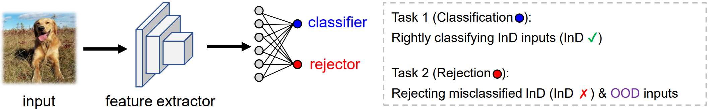
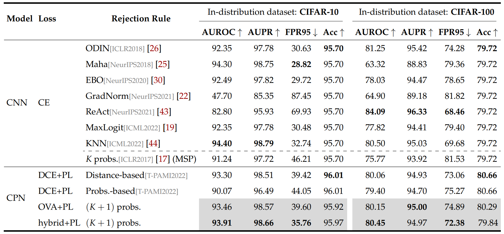
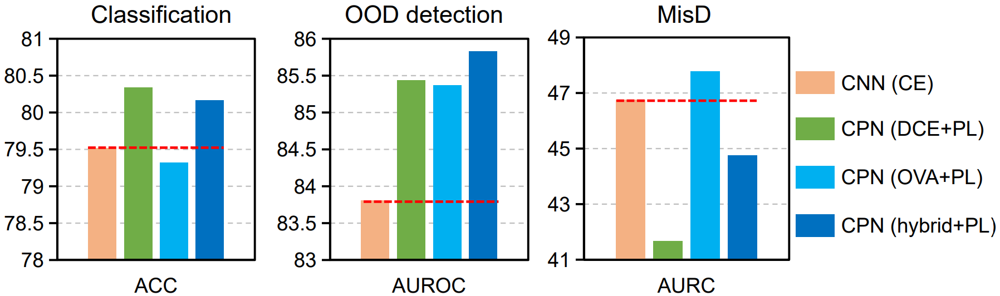

# CPN_OVA_unified

This repository is the PyTorch implementation for paper [Unified Classification and Rejection: A One-versus-All Framework](https://arxiv.org/abs/2311.13355). In this paper, we propose a unified framework for OpenSet Recognition (OSR) or Out-Of-Distribution (OOD) detection, performing multi-class classification and rejection using a single classifier, trained by one-versus-all (OVA) learning without OOD samples. This repository also provides the code to train convolutional prototype network (CPN) based on distance based cross entropy loss (DCE), proposed by [Yang et al.,2018](https://arxiv.org/abs/1805.03438) and [Yang et al.,2022](https://ieeexplore.ieee.org/document/9296325).
<p align="center">
    
</p>
<p align="center">

## Environment settings
This project is conducted under the following environment settings:
<ul>
  <li>OS: Ubuntu 20.04.3</li>
  <li>GPU: RTX 3090</li>
  <li>CUDA: 11.2</li>
  <li>Python: 3.7.13</li>
  <li>PyTorch: 1.12.1</li>
  <li>Torchvision: 0.13.1</li>
</ul>


## Usage
### 1. Dataset Preparation
#### Out-of-distribution dataset for CIFAR

We provide links to download each dataset: [Textures](https://www.robots.ox.ac.uk/~vgg/data/dtd/), [Places365](http://places2.csail.mit.edu/download.html), [LSUN-C](https://www.dropbox.com/s/fhtsw1m3qxlwj6h/LSUN.tar.gz), [LSUN-R](https://www.dropbox.com/s/moqh2wh8696c3yl/LSUN_resize.tar.gz), [iSUN](https://www.dropbox.com/s/ssz7qxfqae0cca5/iSUN.tar.gz) and [SVHN](http://ufldl.stanford.edu/housenumbers/test_32x32.mat). Please download them and place them in the folder of `datasets/ood_data/DATASET`. 

#### Out-of-distribution dataset for ImageNet-200
We have OOD inputs from Textures for evaluation on ImageNet benchmark, and it can be downloaded via the [link](https://www.robots.ox.ac.uk/~vgg/data/dtd/).


### 2. Training
To run CPN based on OVA or DCE training principle for CIFAR/WRN-28-10, an example is:
```
cd ./CIFAR/cifar_scripts
bash cifar_wrn_ova.sh
bash cifar_wrn_dce.sh
```

To run CPN based on OVA or DCE training principle for ImageNet-200/ResNet-50, an example is:
```
cd ./ImageNet200/ImageNet_scripts
bash imagenet_ova.sh
bash imagenet_dce.sh
```


### 3. Testing

To run CPN based on OVA or DCE evaluation for CIFAR-10/WRN-28-10, an example is:
```
eval_cifar_ova.py --model wrn-28-10  \
    --model-path "checkpoints_download_cifar/cifar10_wrn_temp3p0_ova.pth"  \
    --temp 3.0  \
    --dataset cifar-10  \
    --score ova|sigmoid
```
```
eval_cifar_dce.py --model wrn-28-10  \
    --model-path "checkpoints_download_cifar/cifar10_wrn_temp2p0_dce.pth"  \
    --temp 2.0  \
    --dataset cifar-10  \
    --score dist|prob
```
To run CPN based on OVA or DCE evaluation for ImageNet-200/ResNet-50, an example is:
```
python eval_cpn_ova.py --arch resnet50  \
    --temp 1.50  \
    --model_path "checkpoints_download_imagenet/resnet50_200_1.5_0.8_ova.pth.tar"  \
    --name evaluation  \
    --ID_dataset_dir 'imagenet/'  \
    --OOD_dataset_dir 'imagenet_ood/'  \
    --score_OOD ova|sigmoid
```
```
python eval_cpn_dce.py --arch resnet50  \
    --temp 1.50  \
    --model_path "checkpoints_download_imagenet/resnet50_200_1.5_dce.pth.tar"  \
    --name evaluation  \
    --ID_dataset_dir 'imagenet/'  \
    --OOD_dataset_dir 'imagenet_ood/'  \
    --score_OOD prob
```
We provide the checkpoints of [CIFAR/WRN-28-10](https://drive.google.com/drive/folders/1zA1_LrFniLsqT7lsxm288jieVbNdSywh?usp=drive_link) and [ImageNet200/ResNet50](https://drive.google.com/drive/folders/179oyS6Oetssnlo5tvpo17NYRcEfrmvfM?usp=drive_link). The trained models can be evaluated for reproducing the results reported in the paper. Our code for evaluation on OOD detection is implemented based on [Outlier-Exposure](https://github.com/hendrycks/outlier-exposure) and [KNN](https://github.com/deeplearning-wisc/knn-ood). If you have any code related questions, we highly recommened to check the issues in Outlier-Exposure.

## Results
### Performance for CIFAR/WRN-28-10
<p align="center">
    
</p>
<p align="center">

### Performance on ImageNet-200/ResNet-50
<p align="center">
    
</p>
<p align="center">


## Citation
If you find this useful in your research, please consider citing
```
@article{cheng2023unified,
  title={Unified Classification and Rejection: A One-versus-All Framework},
  author={Cheng, Zhen and Zhang, Xu-Yao and Liu, Cheng-Lin},
  journal={arXiv preprint arXiv:2311.13355},
  year={2023}
}
```
and/or our related works
```
@inproceedings{yang2018robust,
  title={Robust classification with convolutional prototype learning},
  author={Yang, Hong-Ming and Zhang, Xu-Yao and Yin, Fei and Liu, Cheng-Lin},
  booktitle={Proceedings of the IEEE Conference on Computer Vision and Pattern Recognition},
  pages={3474--3482},
  year={2018}
}
```
```
@article{yang2020convolutional,
  title={Convolutional prototype network for open set recognition},
  author={Yang, Hong-Ming and Zhang, Xu-Yao and Yin, Fei and Yang, Qing and Liu, Cheng-Lin},
  journal={IEEE Transactions on Pattern Analysis and Machine Intelligence},
  volume={44},
  number={5},
  pages={2358--2370},
  year={2022},
  publisher={IEEE}
}
```